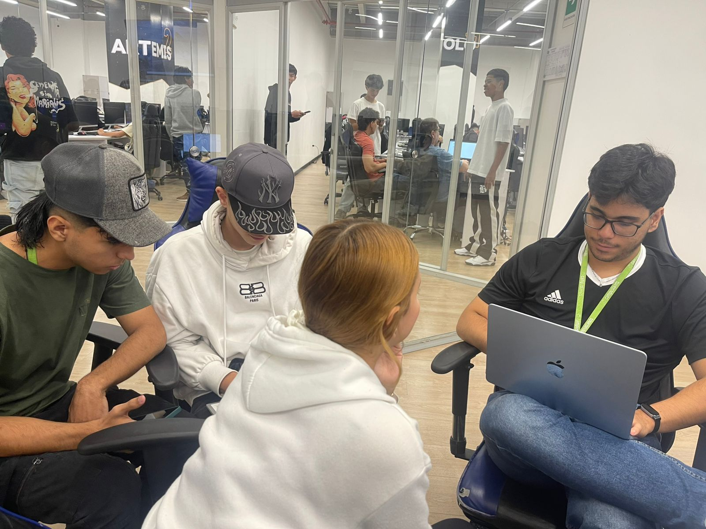
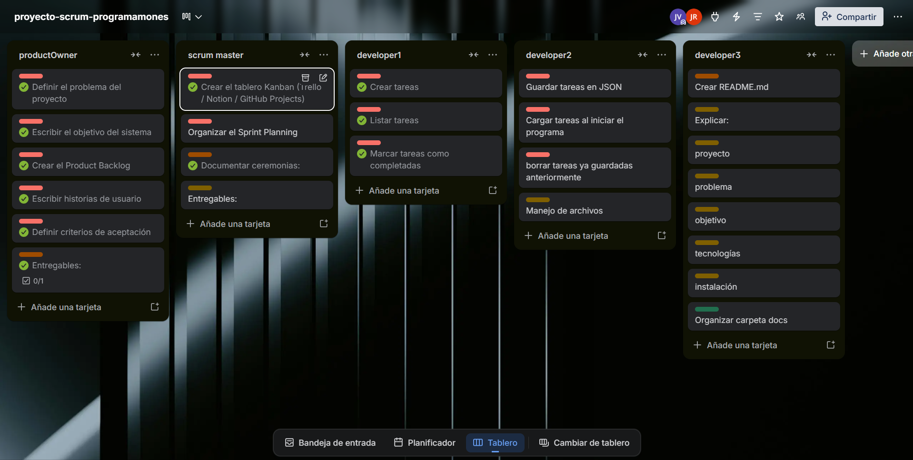

## Sprint Planning

### Información del Sprint
- **Proyecto:** Sistema de gestión de tareas en Python
- **Ceremonia:** Ceremonia 1
- **Duración:** 1 dia
- **Fecha de inicio:** 11/03/2026
- **Fecha de finalización:** 11/03/2026

---

### Objetivo de la ceremonia (Sprint Goal)
Se reunieron los integrantes del proyecto para la seleccion de roles.

---

### ROLES ASIGNADOS
Durante la ceremonia estos fueron los roles asignados:

- NICOLAS ARANGO - PRODUCT OWNER
- JULIAN AGUDELO - SCRUM MASTER
- PEDRO DIAZ - DEVELOPER 1
- JUAN JOSE ACEVEDO - DEVELOPER 2
- JULIETH ROJAS - DEVELOPER 3

---

### Sprint Backlog

| Rol | Integrante | Responsabilidad |
|-----|------------|----------------|
| Scrum Master | Integrante 1 | Gestionar el proceso Scrum, organizar las ceremonias y mantener el Sprint Backlog |
| Product Owner | Integrante 2 | Definir los requerimientos del producto y priorizar el Product Backlog |
| Developer | Integrante 3 | Desarrollar funcionalidades del sistema |
| Developer | Integrante 4 | Implementar y probar el código |
| Developer | Integrante 5 | Apoyar el desarrollo y realizar pruebas |

---

### Herramientas utilizadas

- Git
- GitHub
- Python
- Tablero Kanban (Trello / GitHub Projects)

---

### Resultado del Sprint Planning

Que cada persona sepa que hara con su rol asignado y sepa que tareas y pendientes tiene por hacer.

**Scrum Master**
- Gestiona el proceso Scrum
- Organiza reuniones como Sprint Planning, Daily y Retrospective
- Facilita la comunicación del equipo

**Product Owner**
- Define las funcionalidades del producto
- Prioriza el Product Backlog
- Representa las necesidades del usuario

**Developers**
- Desarrollan el sistema
- Implementan funcionalidades
- Realizan pruebas del código

# Sprint Planning

## Proyecto
Sistema de Gestión de Tareas

## Sprint
Ceremonia 2.

## Duración
1 dia

## Fecha de inicio
12 de marzo de 2026

## Fecha de finalización
13 de marzo de 2026

---

## Objetivo del Sprint
Asigacion de tareas a todos los desarrolladores.

---

## Tareas seleccionadas

- Crear estructura del proyecto
- Implementar función para crear tareas
- Implementar función para listar tareas
- marcar tareas como completadas
- eliminar tareas
- Guardar tareas en JSON

---

## Sprint Backlog

| Tarea | Responsable | Estado |
|------|------|------|
| Crear tareas, listar tareas y marcar tareas como completadas | Developer 1 - Pedro Diaz | Pendiente |
| Crear json, eliminar tareas | Developer 2 - Juan jose Acevedo | Pendiente |
| Crear archivo readme donde estara toda la informacion  | Developer 3 - Julieth Rojas | Pendiente |
